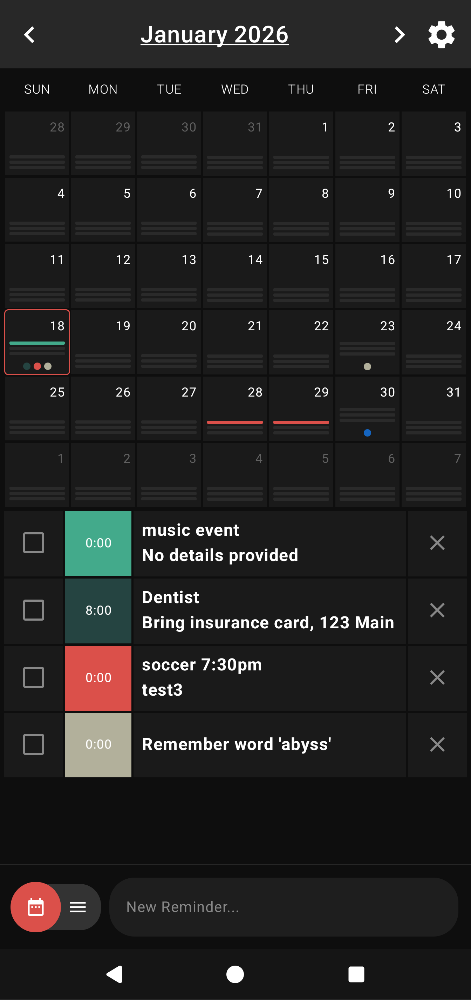
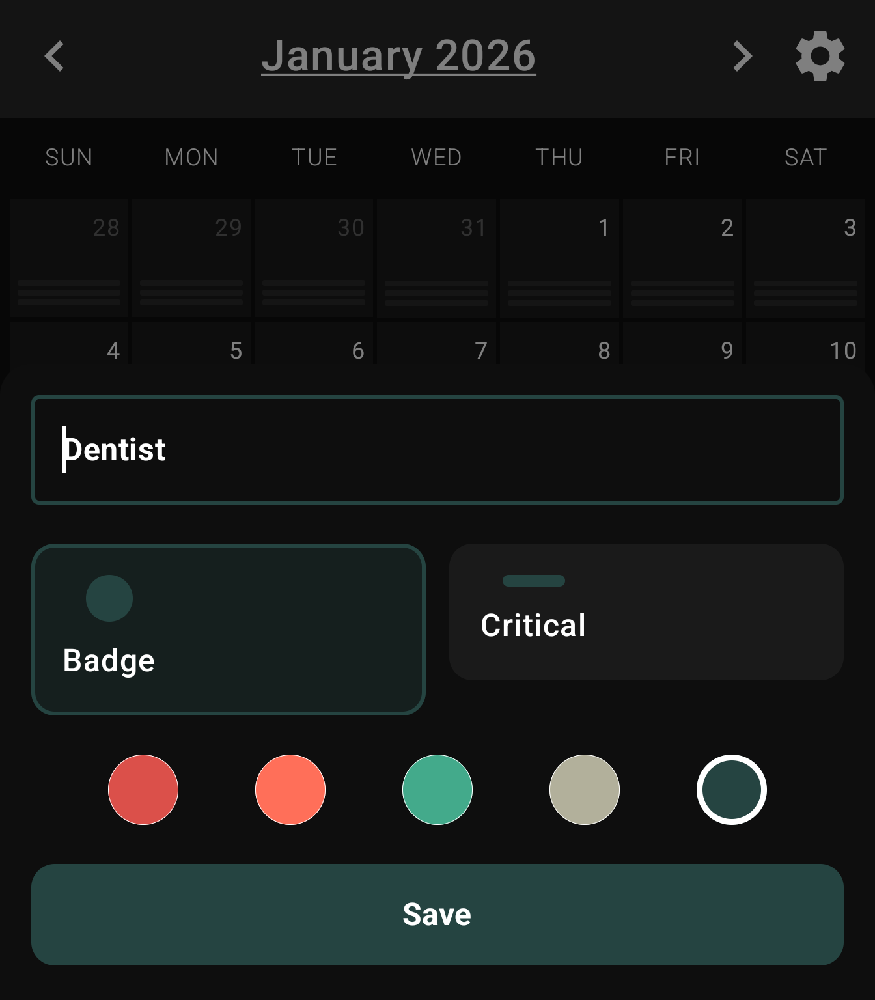
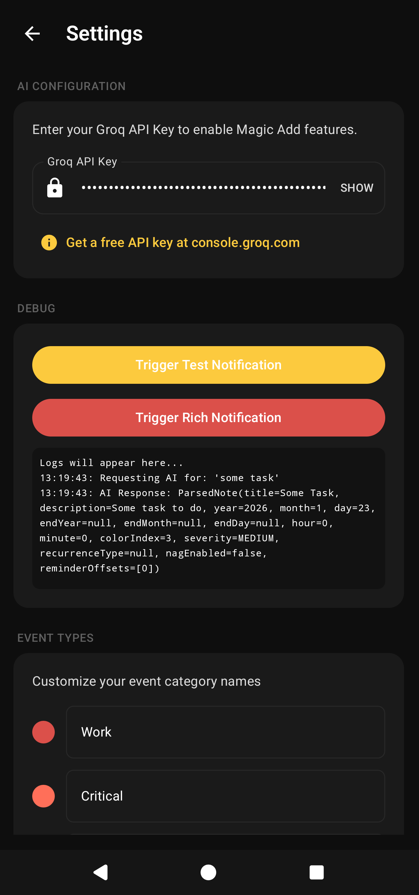

<p align="center">
  
</p>

# Remindr

A calendar app where you just type what you need to remember and AI figures out the rest.

<p align="center">
  
</p>

## The Idea

Type naturally. No date pickers, no dropdowns, no forms. Just say "dentist friday 2pm" or "pay rent tomorrow" and the app parses it, picks a color, and puts it on your calendar.

Uses Groq's free API (llama-3.1-8b) to extract dates, categorize events, and figure out if something is important or just a quick note.

## Lines vs Badges

**Lines** = important stuff. Bills, appointments, deadlines. Things you'll regret missing.

**Badges** = everything else. Shopping lists, random ideas, words you want to remember.

The AI decides which is which based on what you type, but you can always override it.

## How It Works

<p align="center">
  
</p>

1. Type something like "dentist Friday 2pm" or "buy eggs"
2. AI parses it and suggests date, category, urgency
3. Tweak if needed, hit save
4. Done

## Features

- Natural language input with AI parsing
- 5 color categories (customizable names)
- Recurring reminders (daily, weekly, monthly)
- Notifications with multiple reminder offsets
- Nag mode - keeps bugging you until you mark it done
- Works offline too, AI is optional

## Tech

Kotlin Multiplatform, Compose, SQLDelight, Ktor, Groq API.

## Setup

1. Clone and open in Android Studio
2. Grab a free API key from [console.groq.com](https://console.groq.com/keys)
3. Build and run

<p align="center">
  
</p>

```bash
./gradlew :compose-multiplatform:sample:installDebug
```

Enter your API key in Settings and you're good to go.

## Status

Alpha. It works but there are rough edges.
